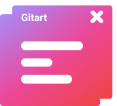

<p align="center"></p>

<h1 align="center">Gitart Vue Dialog</h1>

<p align="center">Vue 3 Dialog/Modal Component + Plugin (optional)</p>

---

📘 [Documentation](https://gitart-vue-dialog.netlify.app/)

🤯 [Examples](https://michaelgitart.github.io/gitart-vue-dialog/)

Typescript support, customizable, beautifully animated, lightweight

~9.9 KiB - index.upd.js `gitart-vue-dialog` <br/> 
~8.9 KiB - index.es.js `gitart-vue-dialog/dist/index.es.js` <br/>
~1.8 KiB - style.css `gitart-vue-dialog/dist/style.css` <br/> 


## Instalation

### Standalone Component

```js
// main.js or YourComponent.vue
import 'gitart-vue-dialog/dist/style.css'
```

```js
// YourComponent.vue
import { GDialog } from 'gitart-vue-dialog'

export default {
  components: {
    GDialog,
  },
}
```

### Plugin

Be sure to read the [documentation](https://gitart-vue-dialog.netlify.app/) for using the plugin

```js
import App from './App.vue'
import { plugin as dialogPlugin } from 'gitart-vue-dialog'
import 'gitart-vue-dialog/dist/style.css'

createApp(App)
  .use(dialogPlugin)
  .mount('#app')
```


## Usage

Read [Documentation](https://gitart-vue-dialog.netlify.app/)


